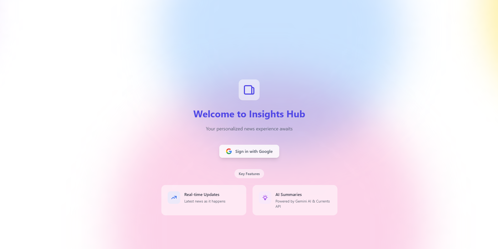
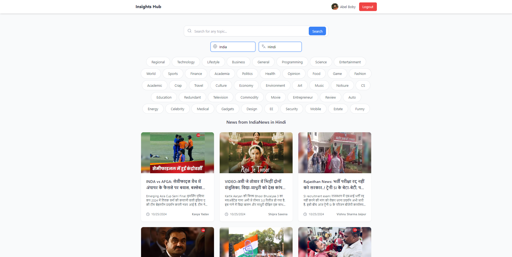
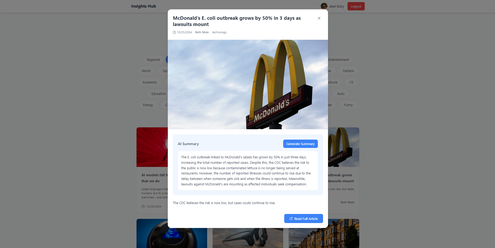

# InsightHub - Personalized News Digest Platform

Welcome to **InsightHub**, a platform designed to deliver real-time, personalized news based on user preferences, with AI-powered article summaries for concise news insights. Hosted on Vercel, InsightHub offers a seamless, engaging experience for anyone seeking relevant news on-demand.

- **Live Demo**: [InsightHub on Vercel](https://insighthub-three.vercel.app/)

---

## Table of Contents
- [Features](#features)
- [Tech Stack](#tech-stack)
- [Getting Started](#getting-started)
- [Screenshots](#screenshots)
- [Project Structure](#project-structure)
- [License](#license)

---

## Features

- **Real-Time News Feeds**: Get the latest news updates based on your preferences.
- **AI-Powered Summaries**: Leveraging Google's Gemini API for fast, concise article summaries.
- **Firebase Authentication**: Secure login with Google sign-in.
- **Customized News Categories**: Choose your preferred categories, regions, and languages.
- **Interactive Filters and Search**: Easily search and filter news by topics, region, or language.

---

## Tech Stack

- **Frontend**: React, Tailwind CSS
- **Backend/Serverless**: Vercel Hosting
- **APIs**:
  - [Currents API](https://currentsapi.services/) - for news content
  - [Google Gemini API](https://cloud.google.com/generative-ai) - for generating article summaries
- **Authentication**: Firebase Auth with Google login
- **UI Icons**: Lucide Icons

---

## Getting Started

1. **Clone the Repository**:
   ```bash
   git clone https://github.com/Abelboby/Insights-Hub.git
   cd InsightHub
   ```

2. **Install Dependencies**:
   ```bash
   npm install
   ```

3. **Environment Variables**: Set up environment variables in a `.env` file in the root directory:
   ```env
   REACT_APP_CURRENTS_API_KEY=your_currents_api_key
   REACT_APP_GEM_API=your_gemini_api_key
   ```

4. **Run the Application**:
   ```bash
   npm start
   ```

---

## Screenshots


- **Home Screen**:
  
  
- **News Filters**:
  
  
- **AI Summary**:
  

---

## Project Structure

- **`src/components`**: Contains reusable components (e.g., `NewsFeed`, `Login`).
- **`src/contexts`**: Context for Authentication.
- **`src/styles`**: Custom Tailwind CSS configurations.
- **`src/App.js`**: Main app setup and routing.

---

Developed with ❤️ by [Saurabh Sushir]